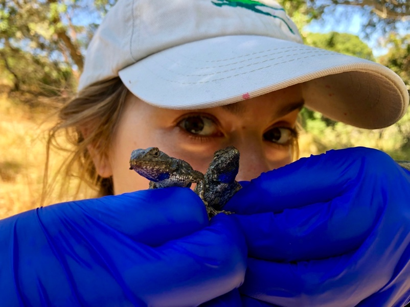

```{r setup, include=FALSE}
knitr::opts_chunk$set(echo = FALSE)
```

## Disease Ecologist

I am a Ph.D. student in Dr. Cherie Briggs at UCSB studying Ecology, Evolution, and Marine Biology. My research implements an interdisciplinary approach to investigate the abiotic and biotic drivers of tick-borne diseases. I use an array of approaches in my research including field surveys, pathogen assays, mathematical modeling, ands transcriptomics. 


