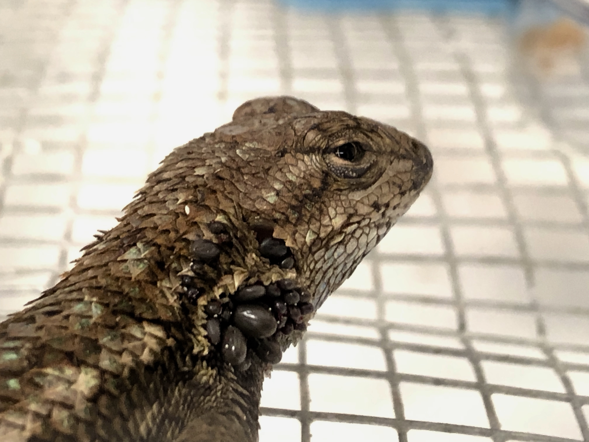
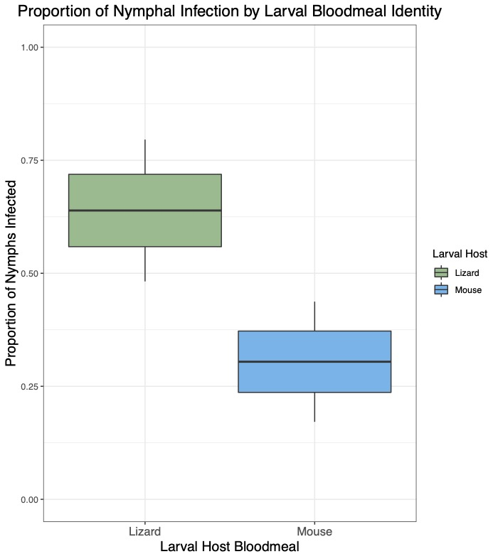
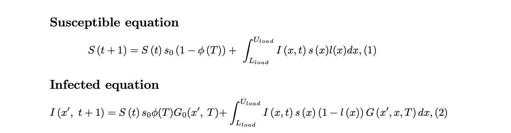
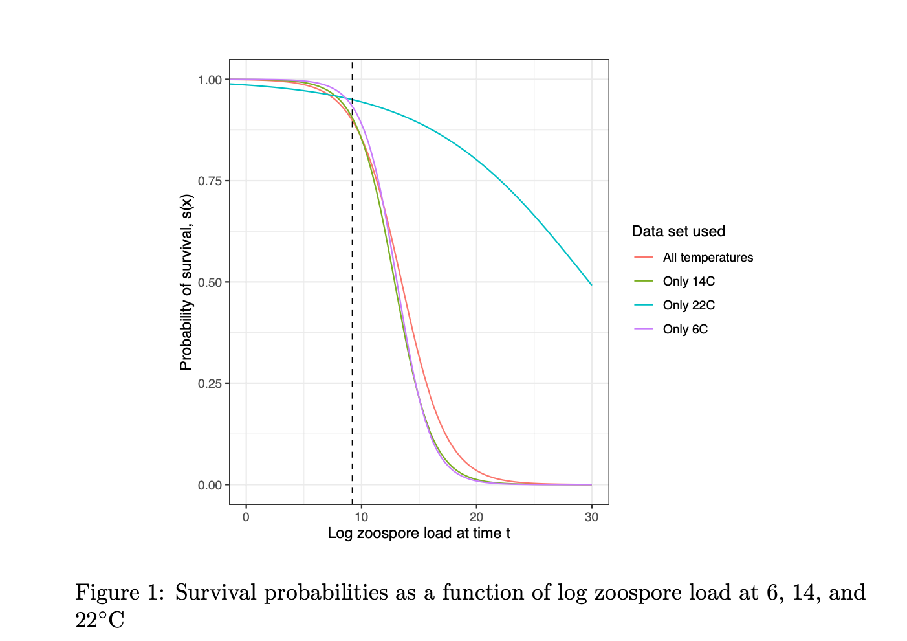
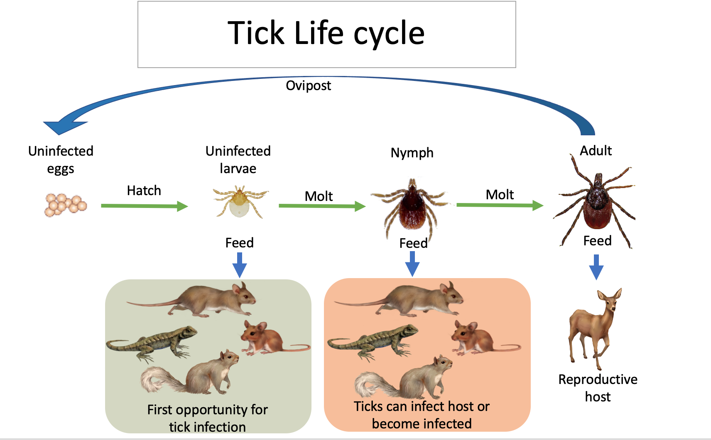

# Projects 

## Tick vector competency 

A vector’s susceptibility and ability to transmit a pathogen — termed vector competency —determines disease outcomes, yet the ecological factors influencing tick vector competency remain largely unknown. Ixodes pacificus, the tick vector of Borrelia burgdorferi (Bb) in the western U.S., feeds on rodents, birds, and lizards. Rodents and birds are reservoirs for Bb and infect juvenile ticks, while lizards are refractory to Bb and cannot infect feeding ticks. Additionally, the lizard bloodmeal contains borreliacidal properties, clearing previously infected feeding ticks of their Bb infection. Despite I. pacificus feeding on a range of hosts, it is undetermined how the host identity of the larval bloodmeal affects future nymphal vector competency. We experimentally evaluate the influence of larval host bloodmeal on Bb acquisition by nymphal I. pacificus. Larval I. pacificus were fed on either lizards or mice and after molting, nymphs were fed on Bb-infected mice. We found that lizard-fed larvae were significantly more likely to become infected with Bb during their next bloodmeal than mouse-fed larvae. We also conducted the first RNA-seq analysis on whole-bodied I. pacificus and found significant upregulation of tick antioxidants and antimicrobial peptides in the lizard-fed group. Our results indicate that the lizard bloodmeal significantly alters vector competency and gene regulation in ticks, highlighting the importance of host bloodmeal identity in vector-borne disease transmission and upends prior notions about the role of lizards in Lyme disease community ecology.

*Publication*:

Ring, K., Couper, L. I., Sapiro, A. L., Yarza, F., Yang, X. F., Clay, K., Mateusiak, C., Chou, S., & Swei, A. (2022). Host blood meal identity modifies vector gene expression and competency. Molecular ecology, 10.1111/mec.16413. Advance online publication. https://doi.org/10.1111/mec.16413

##  IPM modeling Bsal disease dynamics in North American newts 

*Link to written exam*: <a href = 'EEMB_595CA_written_exam.pdf' target = '_blank'>Click here for a PDF</a>

*Background*: Chytridiomycosis, a disease induced by a fungal pathogen, is considered a global panzoonotic and is the main driver of amphibian extinctions globally. The pathogenic chytrid fungi, Batrachochytrium dendrobatidis (Bd) and Batrachochytrium salamandrivorans (Bsal), are responsible for causing the disease chytridiomycosis in frogs and salamanders, respectively, on six continents and 54 countries. Both Bd and Bsal originated in Asia but have spread with amphibian pop- ulations around the world as a part of the pet trade. Despite widespread invasion of chytrid, there are many populations of susceptible amphibians still at risk of infection. Unlike Bd, Bsal has yet to reach North America, making salamanders in the US at risk for a potential invasion event. The first step in preparation for a potential invasion is determining indi- vidual susceptibility of newts in regions where the habitat is suitable for Bsal growth. There are many abiotic and biotic factors that can determine dis- ease outcomes. An abiotic factor that affects both host susceptibility and chytrid fungi virulence is temperature. Here, we use results from a Bsal inoculation experiments to model infection dynamics among the eastern newt, Notophthalmus viridescens at different temperatures.

*The Model*: 

*Results*: Overall, the IPM projected that individual Bsal infected Notophthalmus viri- descens experienced slower pathogen growth which in turn enhanced host sur- vival at 22◦C. This result would suggest that reducing temperature has different proportional effects on Bsal growth depending on the absolute temperature. This result is surprising given that increasing temperature has a linear effect on Bd zoospore growth, with an optimal growth temperature range between 17-25◦C[12,13]. 

## Lyme disease ecology 

Throughout Santa Barbara and on the Channel Islands, there has been an incredible effort to restore degraded habitats back to flourishing ecosystems made up of native flora. Land that was once utilized for agriculture, dairy farms, golf courses, and parking lots are being converted back into grasslands, oak woodlands, coastal sage scrub, wetlands, and coastal dunes. As endemic and native flora are being re-established, so are the native fauna like insects, birds, mammals, and reptiles. While most re-introduced fauna enhances ecosystem services and serves a specific niche, they can also provide a host community for arthropod disease vectors, namely ticks. 

The primary goal of this project is to use an interdisciplinary approach to understand how restoration efforts affect the distribution and prevalence of ticks and tick-borne diseases around Santa Barbara. This project will require field surveys collecting ticks, trapping small mammals, and catching lizards. After gathering meta-community data on ticks and their vertebrate hosts, the project will require subsequent lab work and data analyses including tick ID, pathogen testing, and mathematical modeling. The focal habitats being surveyed include coastal chaparral sites near UCSB and on the Channel Islands, including Coal Oil Point, North Campus Open Space, and Santa Cruz Island. The objectives of this type of research include determining 1) the diversity/abundance of ticks, 2) their common host community, 3) and their pathogen prevalence to 4) assess tick-borne disease risk for those who enjoy outdoor spaces around Santa Barbara.

